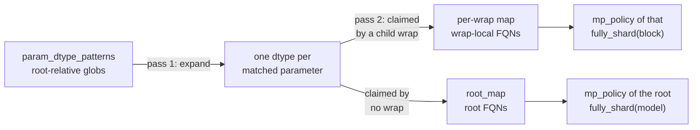

Diffusion RL is unusually sensitive to precision. The PPO ratio is
`exp(log_prob_new − log_prob_old)`, where `log_prob_old` came from the **rollout engine** (without recompute flag) and `log_prob_new` from the **trainer**. Any numeric difference between the two forwards shows up as a ratio drifting off 1.0 — an update signal made of nothing but rounding.

## 1. Global dtype control flags


| Flag                        | Default | Applies to                                                                             |
| --------------------------- | ------- | -------------------------------------------------------------------------------------- |
| `--fsdp-master-dtype`       | `fp32`  | The FSDP-sharded master copy: load dtype, shard dtype, optimizer state.                |
| `--fsdp-reduce-dtype`       | `fp32`  | `MixedPrecisionPolicy.reduce_dtype` — the gradient reduce-scatter.                     |
| `--diffusion-forward-dtype` | `bf16`  | The DiT forward compute on the training side. Must match `--sglang-dit-precision`.    |
| `--sglang-dit-precision`    | `bf16`  | The DiT forward compute in the sglang-d rollout engine.                                |


It is **strongly not recommended** to modify any of these dtype settings unless you have a
thorough understanding of what the change does. The defaults are what keeps `log_prob_new`
comparable to `log_prob_old`; in particular, `--diffusion-forward-dtype` must be set to the same
value as `--sglang-dit-precision`, and `--fsdp-reduce-dtype bf16` trades multi-rank gradient
stability for nothing you want.

## 2. Input dtype control

Autocast is not enough on its own. It governs op *interiors* — matmuls, convolutions — but
element-wise ops run at whatever dtype their inputs already carry. So the dtype of the tensors
handed to the DiT is itself a semantic choice, and it has to match what the family's sglang-d
pipeline feeds its DiT.

Each family therefore declares an `input_dtype_policy` over three boundary inputs:

```python
input_dtype_policy = {"latents": ..., "cond": ..., "timestep": ...}
```


| Value                          | Meaning                                              |
| ------------------------------ | ---------------------------------------------------- |
| `"default"`                    | Cast to the run's `--diffusion-forward-dtype`.       |
| `"fp32"` / `"bf16"` / `"fp16"` | Cast to that dtype specifically.                     |
| `None`                         | Passthrough — keep whatever dtype rollout handed us. |


The base class defaults to passthrough on all three, but the model family dtypes in the
`TrainPipelineConfig` are aligned with sglang-d by default. LTX-2 is the current example:

```python
# miles/backends/fsdp_utils/configs/ltx.py
input_dtype_policy = {"latents": "default", "cond": "default", "timestep": None}
```

**Division of labour:** `input_dtype_policy` owns the boundary; autocast owns the interior. That
split also keeps gradient-checkpointing recompute consistent, since the recomputed forward sees
the same ambient autocast as the original.

## 3. Per-parameter dtype overrides

Some parameters must stay fp32 even in a bf16 forward — timestep embedders, RoPE frequency
buffers, `scale_shift_table`-style modulation parameters. FSDP2's stock `MixedPrecisionPolicy`
is per-wrap, not per-parameter, so miles-diffusion adds a targeted patch.

### Declaring the rule

A model's `FSDPParallelPlan` carries FQN glob patterns, matched against **root-relative** names:

```python
# miles/backends/fsdp_utils/models/diffusers/wan2_2/parallel_plan.py
FSDP_PARALLEL_PLAN = FSDPParallelPlan(
    param_dtype_patterns={
        "*.norm2.*": "fp32",
    },
)
```

Semantics:

- Patterns apply **in declaration order**, and a later pattern overrides an earlier one — a narrow
rule can carve a parameter back out of a broad one.
- A pattern matching **nothing** is an error, not a no-op. Rules do not rot silently when a model
is renamed.
- An assignment equal to the group default compiles to nothing


### How it is compiled

`compile_param_dtype_maps` (`miles/backends/fsdp_utils/mixed_precision.py`) does two passes:



Put simply: the rules name parameters from the model root, but at runtime each `fully_shard`
call looks its parameters up by wrap-local name — the compile step bridges the two. A parameter
belongs to the first `fully_shard` call that reaches it: the block wraps first, the final root
call takes whatever is left, exactly the order in which FSDP2 itself claims parameters. Each
call then gets its own small map in its own namespace; at cast time a hit uses the override
dtype, a miss falls back to the group `param_dtype`. The one thing this cannot express — two
parameters in one wrap group sharing a local name but wanting different dtypes — is rejected at
compile time.

### Expand FSDP2 with param-level dtype control

When any override exists, the actor swaps in `ParamDtypeMixedPrecisionPolicy` — a
`MixedPrecisionPolicy` extended with a per-parameter `param_dtype_map` — and patches FSDP2's
casting path to honour it. Because the patch reaches into FSDP2 internals, it is version-gated on
`torch==2.11.0` and raises on any other version; `requirements.txt` pins the matching torch.

## 4. Verifying the result

To measure any of this, run with:

```bash
--diffusion-debug-mode --debug-skip-optimizer-step
```

The engine then returns per-step debug tensors and the trainer never updates weights, so any
divergence is pure forward-path difference. Watch these metrics:


| Metric                             | What it tells you                                         |
| ---------------------------------- | --------------------------------------------------------- |
| `train/model_output_mean_abs_diff` | Average trainer-vs-rollout `noise_pred` gap.              |
| `train/model_output_max_abs_diff`  | Worst element.                                            |
| `train/model_output_rel_max`       | The worst element relative to the rollout output's scale. |
| `train/log_prob_mean_abs_diff`     | The gap that actually feeds the PPO ratio.                |
| `train/ratio_abs_minus_1`          | How far the ratio sits from 1.0 in a live run.            |


For a sense of scale: the Qwen-Image RoPE cache bug — CPU-built vs CUDA-built frequency tables
differing by fp32 ULPs — produced a frozen-weight `noise_pred` mean |Δ| of about **2e-2**. Small
absolute numbers here are not automatically fine; compare against a known-good run. With CFG
enabled, `noise_pred` is the guided combination scaled by `--diffusion-guidance-scale`, so the
output magnitude — and every abs-diff metric above — scales with it; factor the CFG scale in
before comparing runs.


