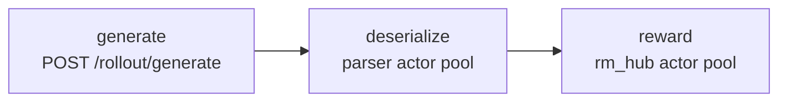

Rollout in miles-diffusion is not "generate everything, then score everything". Each microgroup is generated,
deserialized, and scored as an independent asyncio task, so reward computation and tensor decoding overlap with
generation that is still in flight. This page covers the three stages of that pipeline and the knobs that keep each one
off the critical path.

## 1. The per-microgroup pipeline

`miles/rollout/sglang_diffusion_rollout.py` runs, per microgroup:




The rollout pipeline decomposes into `generate` / `deserialize` / `reward` components. Because every microgroup is its
own `asyncio` task, the engine starts the next request while previous responses are still being unpacked and scored.
Nothing waits for the full batch.

## 2. Deserialization: msgpack + parser-actor pool

Trajectory tensors are large — for video models the response for one microgroup can be gigabytes, and encoding tensors
into base64 further increases the size. In a naive implementation, tensors were base64-encoded inside a JSON body and
parsed on the main asyncio event loop, one sample at a time.

The current path:

- **msgpack raw-bytes transport.** The engine responds with `application/msgpack`; `post(..., raw=True)` returns the
  body untouched, and tensors decode directly from safetensors raw bytes — no base64.
- **Unpacking runs inside Ray actors, not the event loop.** `RolloutImageResponseParserActor.apply_raw(samples, raw)`
  does `msgpack.unpackb` + tensor decode in a separate process (`miles/utils/diffusion_rollout_response.py`), so the
  rollout event loop never blocks on a multi-GB unpack.
- **One call per microgroup.** A whole microgroup is parsed in a single `apply_raw` call — fewer Ray RPCs, one unpack
  per response.
- **A pool, round-robin dispatched.** `--rollout-parser-num-workers N` spins up N parser actors so multiple microgroups
  deserialize in parallel.

Measured on the LTX-2.3 recipe (H200, same config, averaged over two consecutive RL steps, base64/JSON vs the current
path):


| Metric              | base64/JSON | msgpack + pool | Speedup            |
| ------------------- | ----------- | -------------- | ------------------ |
| `perf/rollout_time` | 157.4 s     | 87.6 s         | **~1.8× (−44 %)**  |
| `perf/step_time`    | 321.9 s     | 252.1 s        | **~1.28× (−22 %)** |


## 3. Reward: scored as soon as a microgroup lands

`generate_and_rm_microgroup` calls `batched_async_rm` immediately after parsing, per microgroup — not once at the end of
the rollout:

```python
microgroup = await generate_microgroup(...)   # generate + deserialize
rewards    = await batched_async_rm(args, microgroup)   # score right away
```

Reward workers are Ray actor pools (see [Rewards](../user-guide/rewards.md) for per-reward flags), so scoring one microgroup
overlaps with generation and deserialization of the others.

## 4. Diagnosing the pipeline

Both actor pools report how deep their backlog was, which is what tells you whether a stage is keeping up. When a
microgroup is dispatched, the pool records how many calls that worker already had in flight and keeps the largest value
seen over the rollout:

| Metric | Meaning |
|---|---|
| `perf/parser_max_queue_depth` | Deepest backlog on a parser actor when a response was handed to it |
| `perf/reward_max_queue_depth` | Deepest backlog on a reward actor when a batch was handed to it |

`0` means every dispatch found its worker idle — that stage never made anything wait. A number that climbs with the
number of concurrent microgroups means the stage is saturated and requests are lining up behind it.

Read them together with `perf/rollout_time`:

| Symptom | Look at | Likely fix |
|---|---|---|
| `perf/rollout_time` high | `perf/parser_max_queue_depth` > 0 | Deserialization is the bottleneck; raise `--rollout-parser-num-workers` |
| `perf/rollout_time` high | `perf/reward_max_queue_depth` > 0 | Scoring is the bottleneck; add reward workers, or give them a dedicated GPU |
| `perf/rollout_time` high, both depths `0` | Neither pool is holding anything up | The engines themselves are the limit — check `--rollout-microgroup-size` and `--sglang-server-concurrency` |

Both metrics are emitted only when the corresponding pool ran, so a reward with no actor pool leaves
`perf/reward_max_queue_depth` absent rather than zero.

