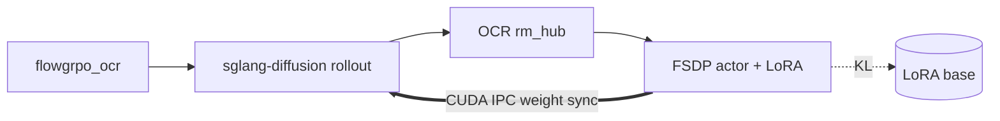

This page takes you from `docker pull` to a running **Flow-GRPO** job on
**Stable Diffusion 3.5 Medium** with **OCR** reward. The launch script below
targets **2 GPUs** (colocate train + rollout); a single GPU also works if you
override the GPU layout. You need Hugging Face access to the gated SD3.5
checkpoint.

Installation and environment setup are documented separately — this page starts
inside a ready container or machine.

Deeper SD3 recipe config, reference curves, and the DiffusionNFT + PickScore
recipe are in the [SD3 model guide](/models/sd3/sd3).

## 1. Start the container

On the **host** (experimental image — see `docker/README.md`):

```bash
docker pull rockdu/miles_diffusion:latest

docker run --rm \
  --gpus all --ipc=host --shm-size=32g \
  --ulimit memlock=-1 --ulimit stack=67108864 \
  --network=host \
  -it rockdu/miles_diffusion:latest /bin/bash
```

Refresh the editable install inside the container:

```bash
cd /root/miles_diffusion && git pull && pip install -e . --no-deps
```

Steps 2–4 below run inside the container (or on any machine with the same deps).

<Note>
Launch recipes live under `scripts/` as **Python modules** (not bash). Each
script sets recipe-specific env vars (e.g. `PYTHONPATH` for SD3
`/rollout/generate`) and submits `train_diffusion.py` through Ray via
`miles.utils.external_utils.command_utils`.
</Note>

## 2. Download model and data

SD3.5 is a **gated** Hugging Face model. Export your token before any download or
training:

```bash
export HF_TOKEN=<your_hf_token>
```

The launch script pulls the checkpoint from the Hub on first run. To prefetch:

```bash
hf download stabilityai/stable-diffusion-3.5-medium \
  --local-dir /root/models/stable-diffusion-3.5-medium
```

Training prompts come from the **`flowgrpo_ocr`** subset of
[`rockdu/miles-diffusion-datasets`](https://huggingface.co/datasets/rockdu/miles-diffusion-datasets).
Each prompt embeds the target string in double quotes (e.g. a logo saying
`"Miles"`) — OCR reward compares PaddleOCR output against that target.

The script downloads the dataset automatically if missing. To prefetch:

```bash
DATASETS_DIR="${DATASETS_DIR:-/root/datasets/miles-diffusion-datasets}"

hf download --repo-type dataset rockdu/miles-diffusion-datasets \
  --include "flowgrpo_ocr/**" \
  --local-dir "${DATASETS_DIR}"
```

| Split | Path |
|---|---|
| Train | `${DATASETS_DIR}/flowgrpo_ocr/train.jsonl` |

See [Rewards](/user-guide/rewards) for OCR scoring and prompt format.

## 3. Launch training

```bash
export HF_TOKEN=<your_hf_token>
python3 scripts/run_diffusion_grpo_sd3_ocr_sglang.py \
  --cuda-visible-devices 6,7
```

The script starts Ray, launches sglang-diffusion rollout engines, loads the
FSDP actor with LoRA, syncs weights via CUDA IPC (`--lora-ipc-weight-sync`),
and runs the Flow-GRPO rollout / train loop. With `WANDB_API_KEY` set, images
and metrics are logged to project `miles-diffusion-grpo`.

After a minute or two you should see rollout/train metrics such as
`rollout/reward/raw_mean`, `train/loss`, and `train/log_prob_mean_abs_diff`
(stdout and WandB when configured).

To finish faster while debugging, override rollout count (default **600**):

```bash
python3 scripts/run_diffusion_grpo_sd3_ocr_sglang.py \
  --cuda-visible-devices 6,7 \
  --num-rollout 2
```

Any `ScriptArgs` field also accepts `MILES_SCRIPT_<FIELD>` (e.g.
`MILES_SCRIPT_NUM_ROLLOUT=2`). For train/rollout alignment debugging (skips the
optimizer step; does not run IPC weight-sync checksums):

```bash
MILES_SCRIPT_DEBUG_ALIGNMENT=1 python3 scripts/run_diffusion_grpo_sd3_ocr_sglang.py
```

## 4. What's happening

Each rollout iteration runs four steps:



1. Sample prompts and generate images via sglang-diffusion (SDE window stepping).
2. Score images with OCR (`--rm-type ocr`) on CPU Ray actors — no reward GPU.
3. Compute the **Flow-GRPO** objective (GRPO advantage normalization + SDE
   log-prob ratios) and step the LoRA optimizer.
4. Push updated LoRA weights to rollout engines via `--lora-ipc-weight-sync`.

This recipe uses **Flow-GRPO** (`--loss-type policy_loss`, the default) with
LoRA-base KL (`--diffusion-kl-beta 0.04`), noise level 0.7, and CFG 4.5.
`--deterministic-mode` and `--global-batch-size 64` match the CI e2e recipe.

Which denoising steps enter the loss is selected by a **step strategy**
(`--diffusion-step-strategy-path` in `miles/rollout/step_strategy_hub.py`):

| Strategy | Behavior | Typical flags |
|---|---|---|
| `sde_window` | Random contiguous window (this recipe) | `--diffusion-num-sde-steps 10`, `--diffusion-sde-window-range 0,10` |
| `epoch_global_random_choice` | Per-epoch random subset of candidate steps | `--diffusion-sde-candidate-steps …`, `--diffusion-num-sde-steps` |

Train-side dynamics and more on these strategies: [SDE step backend](/advanced/sde-backend).

**DiffusionNFT + PickScore** (3 GPUs, ODE, EMA reference) is a separate recipe
covered in the SD3 model guide.

## Inspecting a run

| Question | Where to look |
|---|---|
| Is reward improving? | `rollout/reward/raw_mean` in stdout or WandB |
| Train/rollout SDE aligned? | `train/log_prob_mean_abs_diff` (should stay small) |
| Policy loss stable? | `train/loss`, `train/kl_loss` |
| Rollout or train bottleneck? | `perf/rollout_time`, `perf/train_time` |
| Generated images? | WandB `rollout_media/sample_images` |
