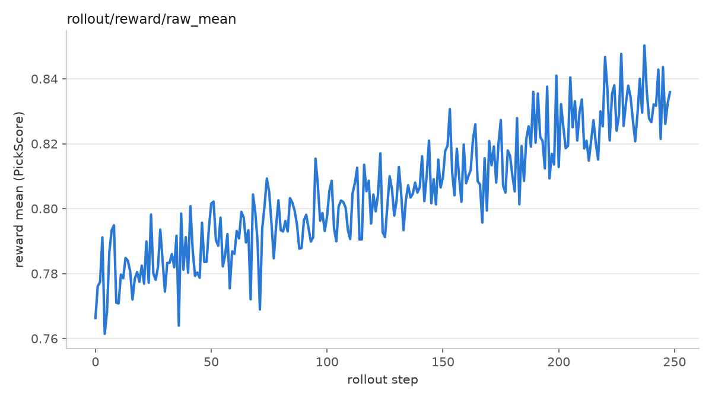

## 1. Model introduction

[Cosmos3](https://huggingface.co/collections/nvidia/cosmos3) is NVIDIA's Mixture-of-Transformers (MoT) omni family: an
**UND** (understanding) tower and a **GEN** (generation) tower over a joint text+vision packed sequence, with the Wan2.2
VAE (4× temporal compression). All sizes share this architecture and differ only in layer count and hidden dim, so
everything below applies family-wide; the canonical recipes are validated on **Cosmos3-Nano**.

**Key highlights for RL training:**

- **No separate text encoder.** Conditioning is token-level: `CondKwargs` carries `text_ids` / `text_mask` / `fps`
  verbatim, which eliminates the text-replay-consistency failure class other families guard against.
- **UND tower frozen inside the training graph.** The UND tower participates in the packed forward, so it is frozen by
  parameter-name fragments rather than dropped; LoRA targets are GEN attention only (`add_q_proj`, `add_k_proj`,
  `add_v_proj`, `to_add_out`).
- **Packed single-sample forward.** The transformer consumes one packed text+vision sequence per forward — one request
  cannot batch multiple outputs, so recipes run `--rollout-microgroup-size 1` and CFG batching is disabled by
  construction.
- **Karras flow-sigma grid.** Checkpoints ship a non-uniform sigma grid; SDE candidate steps must be derived from it.


## 2. Supported variants

All sizes resolve to the same family config — detection matches any checkpoint name containing `cosmos3` / `cosmos-3`.


| Size  | Composition              | HF checkpoints                                                                                                                                                                                                                         | Status                              |
| ----- | ------------------------ | -------------------------------------------------------------------------------------------------------------------------------------------------------------------------------------------------------------------------------------- | ----------------------------------- |
| Nano  | 16 B (8 B UND + 8 B GEN) | [Cosmos3-Nano](https://huggingface.co/nvidia/Cosmos3-Nano), [Cosmos3-Nano-Policy-DROID](https://huggingface.co/nvidia/Cosmos3-Nano-Policy-DROID)                                                                                       | **Validated** — canonical recipes   |
| Edge  | 4 B (2 B + 2 B)          | [Cosmos3-Edge](https://huggingface.co/nvidia/Cosmos3-Edge), [Cosmos3-Edge-Policy-DROID](https://huggingface.co/nvidia/Cosmos3-Edge-Policy-DROID)                                                                                       | Untested                            |
| Super | 64 B (32 B + 32 B)       | [Cosmos3-Super](https://huggingface.co/nvidia/Cosmos3-Super), [Cosmos3-Super-Text2Image](https://huggingface.co/nvidia/Cosmos3-Super-Text2Image), [Cosmos3-Super-Image2Video](https://huggingface.co/nvidia/Cosmos3-Super-Image2Video) | Untested; needs a larger GPU layout |


## 3. Family config

From `miles/backends/fsdp_utils/configs/cosmos3.py`:


| Property       | Value                                            | Why                                                                                                 |
| -------------- | ------------------------------------------------ | --------------------------------------------------------------------------------------------------- |
| Timestep dtype | fp32, no scaling                                 | The Karras grid is non-integer and sgl-d conditions on exact fp32 values — bf16 rounds 993.25 → 992 |
| Cond dtype     | pass-through                                     | mRoPE position ids sit at ~15000 where bf16 spacing is 128; a boundary cast scrambles rotary phases |
| CFG batching   | Off (asserted)                                   | Packed forward is single-sample                                                                     |
| LoRA targets   | GEN attention (`add_*_proj`, `to_add_out`)       | UND tower and unused sound/action heads stay frozen                                                 |
| Frozen params  | Name-fragment allowlist (`_GEN_PARAM_FRAGMENTS`) | UND sits inside the graph and cannot be detached                                                    |


## 4. Launch

Canonical recipe: `scripts/run_diffusion_grpo_cosmos3_pickscore_t2i_4gpu.py` — train, rollout,
and PickScore colocated on 4 GPUs; T2I (832×480, 1 frame).

**Status:** [📈 V — Verified](../../user-guide/recipe-verification.md#v)

```bash
export SGLANG_DISABLE_COSMOS3_GUARDRAILS=1   # RL scores raw samples; skip serving-side guardrail models
python3 scripts/run_diffusion_grpo_cosmos3_pickscore_t2i_4gpu.py
```


## 5. Recipe notes

`epoch_global_random_choice` draws two steps per epoch from
`--diffusion-sde-candidate-steps 8,9,10,11`.

The Cosmos3 checkpoint's Karras flow-sigma grid puts head steps 1–7 at
`sigma > 0.96` with `|dt| < 0.02`; steps 8–11 are the useful high-noise segment.
Step numbers are **not transferable across sigma-grid families**: re-derive candidates
from `|dt|` when changing model or grid.


## 6. Reference results

The 4-GPU colocated Cosmos3-Nano recipe raises PickScore
(`rollout/reward/raw_mean`) from ~0.77 to ~0.85 over 250 rollouts:



## 7. Pairs well with

- [LoRA Training and Weight Sync](../../advanced/lora.md) — GEN-tower LoRA sync.
- [Rewards](../../user-guide/rewards.md) — PickScore worker pool configuration.

