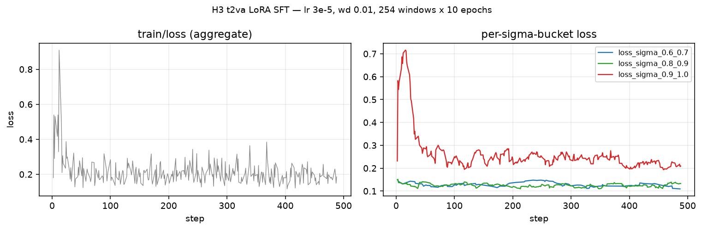
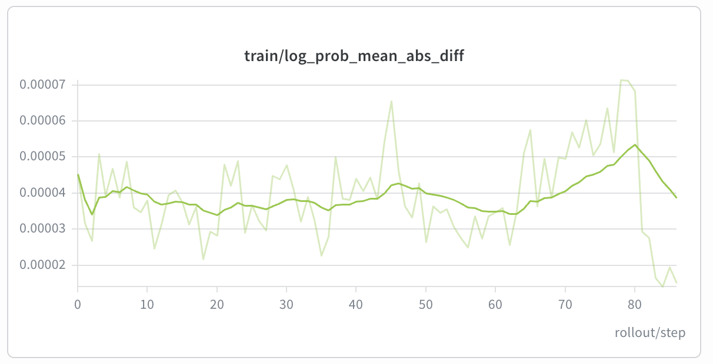
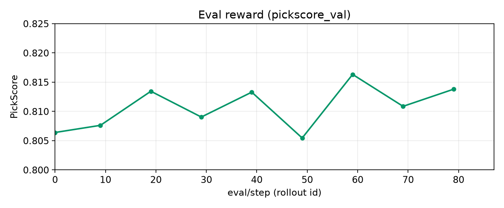
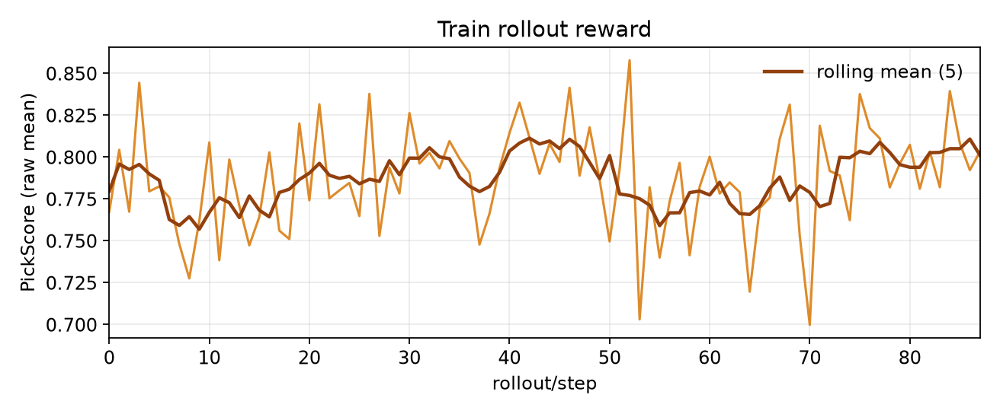

## 1. Model introduction

[MiniMax-H3](https://huggingface.co/MiniMaxAI/MiniMax-H3) is MiniMax's omni-modal generative system: one transformer
denoises a packed text + video + audio sequence and emits video with native stereo audio. MiniMax distilled CFG
into the checkpoint, so the official setting has **no classifier-free guidance** — the recipe is unguided
(`--diffusion-guidance-scale 1.0`). The recipe trains the **t2va** (text-to-audio-video) workflow, video
branch only — the audio stream is rolled out but not trained.

## 2. Supported variants

| Model | HF ID | Notes |
|---|---|---|
| MiniMax-H3 | [`MiniMaxAI/MiniMax-H3`](https://huggingface.co/MiniMaxAI/MiniMax-H3) | t2va video-only Flow-GRPO. `fl2va` / `ref2va` are not trained yet. |

## 3. Family config

From `miles/backends/fsdp_utils/configs/h3.py`:

| Property | Value | Why |
|---|---|---|
| CFG training | Off (asserted) | CFG is distilled into the checkpoint; the forward is unguided |
| Weight sync | `--use-lora --lora-ipc-weight-sync` (asserted) | sgl-d's H3 DiT renames modules and fuses Q/K/V; other sync modes push names the engine drops with a warning, silently training nothing |
| LoRA targets | `attn.to_{q,k,v}`, `attn.to_out.0`, `ff.net.0.proj`, `ff.net.2` | Grouped for the fused engine layers by `h3_weight_key_mapper.collect_h3_lora_layer_groups` |
| Optimizer state | `audio` allowed missing | The audio branch is rolled out but never trained |
| Sample micro-batch | 1 (asserted) | One packed sequence per forward |
| Forced sampling params | `task=t2va`, `short_edge=768`, `conditions=[]` | sgl-d accepts only these for H3, so none of them is exposed as an argument |

## 4. Launch
### 4.1 LoRA SFT on (video, prompt) pairs (8 GPUs, no rollout engines)

Recipe: `scripts/run_diffusion_sft_h3_t2va.py`

**Status:** [📈 V — Verified](../../user-guide/recipe-verification.md#v)

```bash
MILES_SCRIPT_DATA_JSONL=/abs/data.jsonl python3 scripts/run_diffusion_sft_h3_t2va.py
```

### 4.2 Flow-GRPO + PickScore (2 GPUs)

Canonical recipe: `scripts/run_diffusion_grpo_h3_t2va_2gpu.py` — train, rollout, and PickScore
colocated on 2 GPUs; 16:9 / 4 s (with `short_edge=768` the canvas is 1344×768 / 107 frames).

**Status:** [📈 V — Verified](../../user-guide/recipe-verification.md#v)

```bash
# alignment diagnostic: freeze the weights, so log_prob_mean_abs_diff measures
# train-vs-rollout deviation rather than parameter drift
python3 scripts/run_diffusion_grpo_h3_t2va_2gpu.py \
  --num-rollout 2 --eval-interval 0 --extra-args "--debug-skip-optimizer-step"

# long run at the resource-limited scale
python3 scripts/run_diffusion_grpo_h3_t2va_2gpu.py \
  --rollout-batch-size 4 --n-samples-per-prompt 16
```

## 5. Recipe notes

SFT: the encode pool (`miles/rollout/encoder_hub/h3.py`) imports the engine's own recipes
(`minimax_h3_packed_sequence`, `minimax_h3_encode_reference_video_rows`,
`minimax_h3_text_only_ids`), so cached train pairs stay bit-compatible with the engine's
rollout conditioning. Dataset clips must already sit on the serving grid (short_edge=768
canvas, 24 fps, 17n+5 frames); `--sft-offload-encoder` keeps the ~70GB encoder pair in host
RAM outside encode bursts, and `--train-only` lifts the LoRA-IPC weight-sync requirement.
`scripts/export_lora.py` converts any saved checkpoint into one safetensors file (+
`adapter_config.json` sidecar) directly loadable by sgl-diffusion's `--lora-path`.

H3 solves `x0 = x + sigma * v`, the opposite sign from the flow-matching convention the shared
train and rollout steps assume, so `compute_noise_pred` returns the negated velocity. Both halves
must agree: a flipped sign still produces plausible latents and trains on garbage.

The rollout engine needs sglang's `sglang-miles-h3` branch, which
[Installation](../../getting-started/installation.md) already builds from
(`SGLANG_DIFFUSION_BRANCH`). An engine built from sglang `main` rejects the run with
`MiniMax H3 does not support rollout`.

## 6. Reference results
### 6.1 LoRA SFT (8 GPUs)

Recipe defaults on a 254-window video dataset, 10 epochs (280 steps): the aggregate loss is
dominated by which sigmas each 8-sample step happened to draw, while the per-bucket curves
(`--log-loss-sigma-bucket`) descend cleanly — read convergence from the buckets, not the aggregate.



### 6.2 Flow-GRPO + PickScore (2 GPUs)

Long run (`rollout_batch_size=4`, `n_samples_per_prompt=16`):

- `train/log_prob_mean_abs_diff` stays in **1.4e-5 .. 7.1e-5** (under `1e-4`).
- Eval PickScore (`eval/pickscore_test`, every 10 rollouts): **0.806 → 0.814**, peak **0.816** at step 59.
- Train `rollout/reward/raw_mean` sits around **~0.79** (64 samples / step; noisier than eval).

This is the batch-4 curve; it is not evidence for a larger topology, and no larger canonical H3
topology is committed yet.

<p>
  
  
</p>



## 7. Pairs well with

- [LoRA Training and Weight Sync](../../advanced/lora.md) — the IPC merge this recipe requires.
- [Rewards](../../user-guide/rewards.md) — PickScore worker pool configuration.
