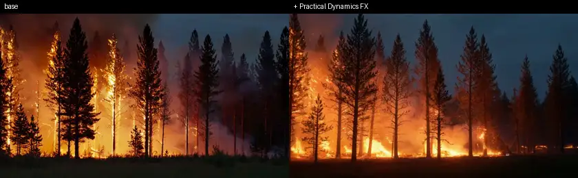
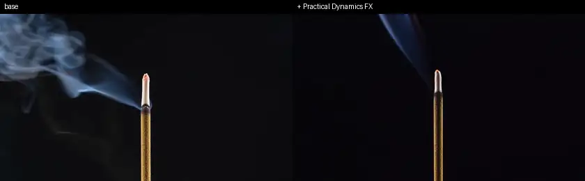
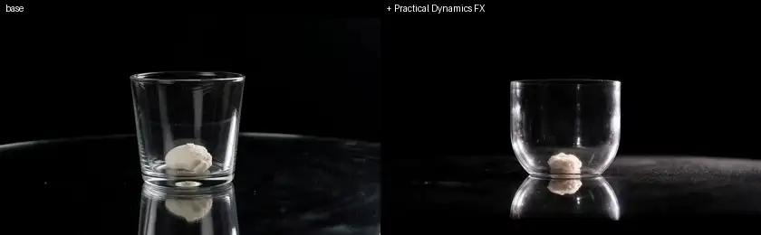
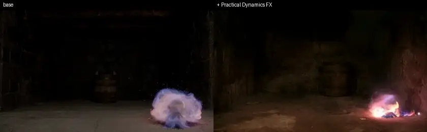

# Training an H3 LoRA with miles-diffusion SFT

Follow this guide to tune **an explosion / fire / smoke reality enhancer** for MiniMax-H3.
The LoRA is always-on: no trigger word, just load it. Alpha is the strength slider
(128 = full, 64 = half).

## 1. Topic selection

The H3 base is already very strong on aesthetics and general quality (high-grade official
data, CFG distilled), so **a purely aesthetic LoRA struggles to add value** — our first
attempt (a lighting LoRA) ended as a negative result. One viable differentiation is physical dynamics, which
the base is *relatively* weak at (though still strong enough compared with other open source models). Topic selection decides the outcome; verify the base model's weakness with a handful of comparison generations before investing in data work.

## 2. Data curation

H3 is strong. Most stock footage looks *worse* than what it generates, and metadata
filters can't tell (<20% usable yield). So we built a data pipeline: **a VLM watches the
frames for coarse screening, a human GSB blind test makes the fine cut**, and
preprocessing (next section) lands the winners on H3's serving grid.

```
WISA-80K (79,480)
  → keyword recall for splash/smoke/explosion       4,563 clips
  → Qwen2.5-VL-7B judges 6 frames per clip          top 500 (180/160/160)
  → H3 generations from the same prompt + seed      500 counterparts
  → human GSB blind test, 500 pairs                 198 dataset wins
  → visual dedup (frame correlation > 0.9)          193 clips → 254 training windows
```

- **VLM rubric**: five-field JSON — `category_ok / spectacle / quality / watermark /
  mostly_static`; total = `0.5*spectacle + 0.3*quality + 2*category_ok - 4*watermark
  - 3*mostly_static`. About 5.4 s/clip on 8 GPUs — the full pool screens overnight.
- **The GSB blind test is the final quality gate**: randomized sides per pair, opaque
  video URLs (untraceable even from devtools), source revealed after each vote. It
  answers one question — "is this clip actually better than what H3 generates itself?" —
  and only winners enter the training set. Of the 500 pairs, 198 went to the dataset, 187 to
  H3, and 115 were draws; a draw does not enter either, so only ~40% of screened candidates
  survive (splash 40% / smoke 41% / explosion 38%). On the pairs that were decided the
  dataset only just edges H3 out, 51%.
- Long clips yield up to two non-overlapping windows (one 10 s source = 2 training
  samples sharing a caption).

## 3. Preprocessing

Data must land exactly on H3's serving grid (the encoder rejects anything off-grid):

| Item | Value |
|---|---|
| Canvas | short_edge=768, 16:9 → 1344×768 |
| Frame rate | 24 fps (strictly validated, ±0.01) |
| Frame count | 17n+5 lattice, minimum 107 frames ≈ 4.46 s |

One ffmpeg pass (the same chain the engine uses): `fps=24,
scale=...:flags=lanczos, crop=1344:768`, cut to 107 frames. The training manifest is a
jsonl, one line per sample:

```json
{"prompt": "...", "metadata": {"video": "clips/clip.mp4"}}
```

Relative paths are anchored at the jsonl's own directory — the dataset works wherever it
is downloaded.

The output of sections 2–3 is published as
[rockdu/WISA-80K-Practical-Dynamics-254](https://huggingface.co/datasets/rockdu/WISA-80K-Practical-Dynamics-254)
(254 windows + train.jsonl, fully curated **and already on the serving grid**) — to train
on it you skip both sections and go straight to training below.

## 4. Training

```bash
export WANDB_API_KEY=...                       # without it the recipe submits no wandb flags at all
python3 scripts/run_diffusion_sft_h3_t2va.py   # zero arguments: downloads the dataset above on first run and trains
# custom data:      --extra-args "--prompt-data /abs/train.jsonl"
# delivery config:  --num-epoch 10   (recipe default is 3)
```

Watch the run's log in wandb (project `miles-diffusion-sft`).

The recipe defaults are exactly the validated optimum: **lr 3e-5, weight decay 0.01,
LoRA rank 64 / alpha 128, rollout batch 32 (1 sample per GPU per optimizer step)**,
`--fsdp-flow-shift 12.0`, `--diffusion-guidance-scale 1.0` (H3 has no CFG),
`--sft-offload-encoder`.

miles-diffusion started with RL and later grew to cover SFT. Read a rollout here as whatever
produces the next batch of training samples — RL generates them, SFT encodes them. Each batch is
then consumed by `--num-steps-per-rollout` 4 optimizer steps. Both fit the same loop, which is
why `iter_N` counts rollouts rather than steps.

Performance reference (8×H200, 254 windows):

| Stage | Cost |
|---|---|
| Encoding | ~15 s/clip/GPU; the first 8 rollouts (one dataset pass) each stall ~110 s on their own misses, 230 s for rollout 0 which builds the pool; warm from rollout 8 |
| Cache | content-addressed, ≈2× dataset size, lives in `.sft_cache/` next to the jsonl, reused across runs |
| Encoder residency | `--sft-offload-encoder`: the ~70 GB encoder sleeps in host RAM and only occupies the GPU during encode bursts |
| Training | ~31 s per optimizer step, `--num-steps-per-rollout` 4 of them per encoded batch |
| Checkpoints | saved at every epoch boundary and on the final rollout; iter_N means N rollouts completed |

End to end, the default 3 epochs (21 rollouts, 84 steps) take 66 min from a cold cache;
10 epochs (70 rollouts, 280 steps) take 2 h 50 min cold, 2 h 31 min on a warm one.

Training leaves DCP checkpoints only. Export the LoRA with one single command:

```bash
python3 scripts/export_lora.py --ckpt-dir <run>/ckpt/iter_0000070 \
  --out practical_dynamics_fx.safetensors --lora-rank 64 --lora-alpha 128
```

This writes the safetensors plus an `adapter_config.json` sidecar; sgl-diffusion loads it
directly via `--lora-path`. Keep the two files together — the sidecar is looked up in the
safetensors' own directory, and without it alpha falls back to rank, i.e. half strength.

Reference loss (8×H200, same figure as the repo docs):


## 5. Training tips

**Learning rate is extremely sensitive.** Ablation on identical data and config (rank 64 / alpha 128, 254 windows × 10 epochs):

| lr | Outcome |
|---|---|
| 3e-4 | collapses |
| 1e-4 | visible frame degradation |
| 5e-5 | overfitting signs within the first epoch |
| **3e-5** | **best** ✅ |
| 1e-5 | underfits, barely differs from base |

Other tips for DiT LoRA SFT:

- **Watch bucketed loss, not the aggregate**: DiT loss magnitude varies hugely with the
  noise level, so the aggregate curve mostly reflects which sigmas a step happened to
  draw — not training progress. The per-bucket curves from `--log-loss-sigma-bucket`
  (default 10 buckets) compare like with like.
- **Quality beats quantity**: ~200 clips that survived the GSB gate converge in
  10 epochs and outperform larger, looser pools.
- **Don't train audio**: real-footage audio tracks are noisy; the t2va recipe trains only
  the video branch — audio is rolled out but excluded from the loss.

## 6. Results

### Showcase



Beyond looking better, the LoRA also fixes physical badcases of the base model — below:
incense burning upside down, and smoke passing straight through glass.





### Known boundaries

Generalization beyond the dataset's distribution is limited. On ten out-of-distribution
detailed prompts related to fire / explosions / smoke, the LoRA scored 6 wins / 3 losses / 1 tie against base — the reliable
wins stay close to the training distribution.



Lower alpha or unload for:

| Scenario | What goes wrong at full strength |
|---|---|
| Multi-beat scripted events (e.g. fuse burns, then explodes) | later beats get consumed to amplify the current dynamic |
| Restrained macro shots                                      | over-energizes what should stay subtle                  |

### Artifact

`practical_dynamics_fx.safetensors` (rank 64, alpha 128, ~1.4 GB) + `adapter_config.json`.

```bash
sglang serve --model-path MiniMaxAI/MiniMax-H3 \
  --lora-path practical_dynamics_fx.safetensors   # alpha is read from the sidecar
```
