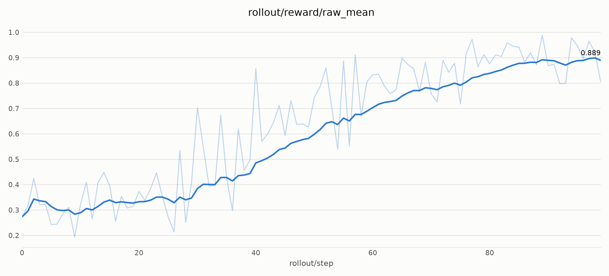

## 1. Model introduction

[Krea-2-Raw](https://huggingface.co/krea/Krea-2-Raw) is a text-to-image flow-matching DiT. Its rollout runs on
sglang-diffusion at 1024×1024 in bf16.

**Key highlights for RL training:**

- **One sample per rollout request.** The engine's krea2 pipeline has no per-request output expansion, so recipes run
  `--rollout-microgroup-size 1` (enforced by the family config).
- **Flow time as the timestep input.** The DiT takes sigma in [0, 1]; its sinusoidal embedding applies the ×1000 itself.
- **Multi-layer text conditioning.** `encoder_hidden_states` carries several text-encoder layers per token, and
  `position_ids` puts zero rows for text before the latent grid.

## 2. Supported variants

| Variant | HF checkpoint | Status |
| --- | --- | --- |
| Raw | [krea/Krea-2-Raw](https://huggingface.co/krea/Krea-2-Raw) (gated: needs `HF_TOKEN`) | Recipes below |

## 3. Family config

From `miles/backends/fsdp_utils/configs/krea2.py`:

| Property | Value | Why |
| --- | --- | --- |
| Rollout microgroup | 1 (validated) | The engine serves one output per request |
| Timestep input | sigma, no ×1000 | The DiT's embedding scales it internally |
| Cond collation | Pad text to the batch max; one latent grid per batch | Position ids of the grid depend only on resolution |
| Text mask | Dropped when every token is valid | Matches the rollout DiT's maskless fast path |
| CFG combine | `neg + scale · (pos − neg)`, `true_cfg_scale` wins when set | Same formula as the engine |

## 4. Launch

Both recipes train DiffusionNFT with the OCR reward (no reward GPU), LoRA rank 32, an EMA rollout policy and
deterministic ODE rollouts (10 steps, no CFG).

### 4.1 Synchronous, 2 GPUs colocated

`scripts/run_diffusion_nft_krea2.py` — FSDP DP=2 sharing the GPUs with two sglang engines; LoRA adapters sync over
CUDA IPC. 8 prompts × 8 samples per step, micro-batch 2 with gradient checkpointing.

```bash
python3 scripts/run_diffusion_nft_krea2.py
```

### 4.2 Asynchronous, 6 training + 2 rollout GPUs

`scripts/run_diffusion_nft_krea2_async.py` — runs `train_diffusion_async.py`: each batch is sampled under the EMA while
the previous batch trains, on separate pools; LoRA adapters sync to the rollout engines over NCCL. One prompt × 8 samples
per training GPU (6 × 8 per step), micro-batch 4, no gradient checkpointing.

**Status:** [🧩 PG — Proxy gated](../../user-guide/recipe-verification.md#pg) by
`tests/e2e/short/test_krea2_nft_ocr_async_8xGPU_4xGPU_proxy.py`, which runs `--four-gpu-ci`: half of each pool and of
the batch (3 training + 1 rollout GPUs, 3 × 8 per step), so every training GPU keeps the production micro-batches.

```bash
python3 scripts/run_diffusion_nft_krea2_async.py
```

## 5. Reference results

The 6 + 2 async recipe raises the OCR reward (`rollout/reward/raw_mean`) from ~0.29 (mean of the first 10
rollouts) to ~0.88 (mean of the last 10) over 100 rollouts, at ~79 s per rollout:



After the 100 rollouts, the held-out OCR accuracy (`eval/ocr_test`, 1018 prompts, 52 denoising steps) is 0.875.

## 6. Pairs well with

- [LoRA Training and Weight Sync](../../advanced/lora.md) — IPC and NCCL adapter sync.
- [Rewards](../../user-guide/rewards.md) — the OCR reward.
