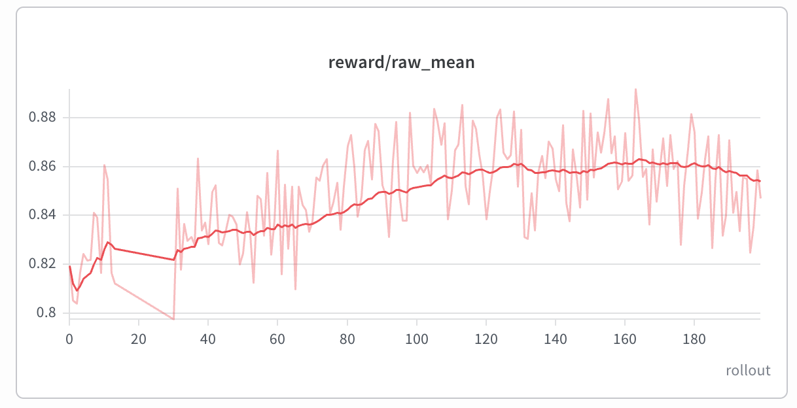
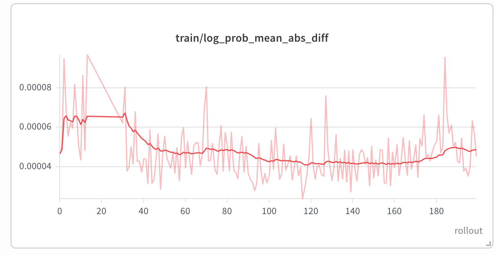

## 1. Model introduction

[Qwen-Image 2.1](https://huggingface.co/Qwen/Qwen-Image-2.1) is the unified text-to-image
and image-to-image successor of Qwen-Image. Conditioning is Qwen3-VL (pre-final-norm
hidden states); the DiT is a single-stream block-causal transformer with an RGBA VAE.
CFG is distilled into the checkpoint, so the official default is **no guidance**.

miles-diffusion trains the **T2I** path. Image-conditioned editing is served by the
rollout engine but is not a recipe yet.

Day-0 references:

- diffusers [`#14804`](https://github.com/huggingface/diffusers/pull/14804)
- sglang-diffusion [`#39983`](https://github.com/sgl-project/sglang/pull/39983)

## 2. Supported variants

| Model | HF ID | Notes |
|---|---|---|
| Qwen-Image 2.1 | [`Qwen/Qwen-Image-2.1`](https://huggingface.co/Qwen/Qwen-Image-2.1) | Family key `qwen_image21` |

A name containing `qwen-image-2.1`, `qwen-image-21`, `qwenimage21`, or
`qwen_image21` resolves to this family. Matching keeps the longest pattern, so
`Qwen/Qwen-Image-2.1` resolves to `qwen_image21`.

## 3. Family config

Registered in `miles/backends/fsdp_utils/configs/qwen_image21.py`:

| Property | Value | Why |
|---|---|---|
| Timestep scaling | Trajectory timesteps ÷ 1000 | Matches diffusers' `t / 1000`; sglang-d divides inside the DiT |
| CFG combine | `uncond + scale·(cond − uncond)`, **no** cond-norm rescale | Mirrors `pipeline_qwenimage21` |
| Cond collation | Pad `encoder_hidden_states`, rebuild `img_mask` = text zeros + target slots, `img_shapes` from `--diffusion-height/width` | Rollout sends Qwen3-VL text; the train DiT wants the joint mask |
| Noise pred | Slice `[:, -target_tokens:]` | Single-stream forward emits the joint sequence |
| RoPE caches | Rebuilt on CUDA after materialize | Same CPU/CUDA `torch.pow` trap as 1.0 |
| LoRA targets | `to_q/k/v`, `to_out.0`, `img_mlp.{proj,out,gate_layer}` | Single-stream block; no text-branch add-proj |

## 4. Launch

Canonical recipe: `scripts/run_diffusion_grpo_qwenimage21_pickscore_1gpu_v2.py` — 1
colocated GPU, train + sglang + PickScore, 512×512, 16×16 group, lr 1e-4.

The engine must be the sglang 2.1 branch and diffusers must export
`QwenImage21Transformer2DModel`. If those checkouts are not already on
`PYTHONPATH`, point `SGLANG_21_PYTHON` and `DIFFUSERS_21_SRC` at them.
Real-weight GRPO needs ≥80GB; 32GB only finished generate.

**Status:** [📈 V — Verified](../../user-guide/recipe-verification.md#v) — 200 rollouts.
Smoothed `rollout/reward/raw_mean` rises from about 0.81 to about 0.86.

```bash
# alignment diagnostic: freeze weights so log_prob_mean_abs_diff is train-vs-rollout
python3 scripts/run_diffusion_grpo_qwenimage21_pickscore_1gpu_v2.py \
  --num-rollout 2 --eval-interval 0 --extra-args "--debug-skip-optimizer-step"

# local / dummy checkpoint + local prompts
python3 scripts/run_diffusion_grpo_qwenimage21_pickscore_1gpu_v2.py \
  --hf-checkpoint /path/to/qwen-image-2.1 \
  --prompt-data /path/to/flowgrpo_pickscore
```

## 5. Recipe notes

- Official sampling is 40 steps / CFG 1. This recipe uses 10 steps and the
  same SDE window as Qwen-Image 1.0 (`--diffusion-sde-window-range 3,5`, 2 SDE
  steps). Default is 16 prompts × 16 samples, lr 1e-4, 200 rollouts.
- `--rollout-patch-group qwen_image21` wipes the engine's prefix KV cache
  every step and disables the 2.1 fused kernels so every SDE step reruns the
  full joint sequence, matching the trainer.
- `--rollout-return-full-trajectory` is on so train-pair conversion can index
  the SDE window against a full 0..T latent array.
- `--sglang-lora-merge-mode dynamic` keeps PEFT unmerged on the engine, same as 1.0.
- A 32 GB card will not hold the full 2.1 DiT + Qwen3-VL + VAE + PickScore at
  1024² without offload. Raise batch/resolution only after adding GPUs or
  component offload.

## 6. Reference results

The canonical 1-GPU recipe over 200 rollouts (512², 16×16, lr 1e-4):



Smoothed `rollout/reward/raw_mean` moves from about 0.81 to about 0.86.
`train/log_prob_mean_abs_diff` stays near 4e-5 on the same run:



## 7. Pairs well with

- [Qwen-Image 1.0](qwen-image.md) — the flow_grpo-aligned 5-GPU reference recipe.
- [LoRA weight sync](../../advanced/lora.md) — `--lora-ipc-weight-sync` is on.
- [Deterministic Training](../../advanced/deterministic.md) — `--deterministic-mode` is on.
