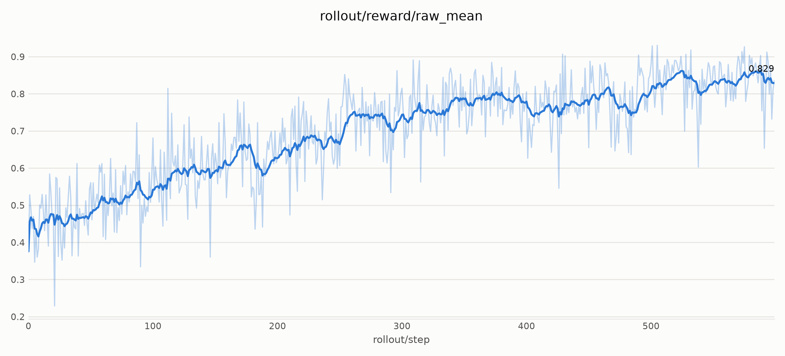
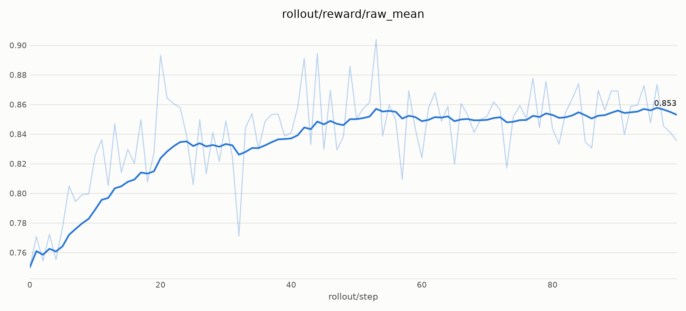

## 1. Model introduction

[Stable Diffusion 3.5 Medium](https://huggingface.co/stabilityai/stable-diffusion-3.5-medium)
is the primary SD3 checkpoint used in miles-diffusion recipes. SD3 uses a
DiT transformer with dual text-encoder conditioning (`encoder_hidden_states` +
`pooled_projections`).

**Key highlights for RL training:**

- Single DiT component — weight sync targets `--update-weight-target-module transformer` (default).
- LoRA on all attention projections (self-attn + cross-attn add projections).
- Supports **Flow-GRPO** (OCR) and **DiffusionNFT** (PickScore) objectives.
- Gated Hugging Face model — requires `HF_TOKEN`.

## 2. Supported variants

| Model | HF ID | Notes |
|---|---|---|
| SD3.5 Medium | [stabilityai/stable-diffusion-3.5-medium](https://huggingface.co/stabilityai/stable-diffusion-3.5-medium) | Default in all SD3 scripts |
| SD3 (other sizes) | Any checkpoint whose name contains `stable-diffusion-3` or `sd3` | Auto-detected by family resolver |

Override family detection when the checkpoint name does not match a registered
pattern (e.g. a renamed local directory):

```bash
--diffusion-model-family sd3
```

## 3. Environment setup

SD3.5 is gated — export your Hugging Face token:

```bash
export HF_TOKEN=<your_hf_token>
```

Optional prefetch:

```bash
hf download stabilityai/stable-diffusion-3.5-medium \
  --local-dir /root/models/stable-diffusion-3.5-medium
```

Prompt datasets live under
[`rockdu/miles-diffusion-datasets`](https://huggingface.co/datasets/rockdu/miles-diffusion-datasets):

| Recipe | Subset | Train path |
|---|---|---|
| GRPO + OCR | `flowgrpo_ocr` | `.../flowgrpo_ocr/train.jsonl` |
| NFT + PickScore | `flowgrpo_pickscore` | `.../flowgrpo_pickscore/train.jsonl` |

Launch scripts download the matching subset automatically via
`command_utils.hf_download_dataset`. Override the download root with
`--data-dir` (default `/root/datasets` →
`/root/datasets/miles-diffusion-datasets`).

## 4. Family config

Registered in `miles/backends/fsdp_utils/configs/sd3.py`:

```python
@register_train_pipeline_config("sd3")
class SD3TrainPipelineConfig(TrainPipelineConfig):
    hf_ckpt_name_patterns = ("stable-diffusion-3", "sd3")
    lora_target_modules = [
        "attn.to_q", "attn.to_k", "attn.to_v", "attn.to_out.0",
        "attn.add_q_proj", "attn.add_k_proj", "attn.add_v_proj", "attn.to_add_out",
    ]
```

Family resolution (`resolve_diffusion_model_family`) matches `--hf-checkpoint`
names against `hf_ckpt_name_patterns`. `--hf-checkpoint` is the single source
for the HF repo / local directory used by both FSDP training and
sglang-diffusion rollout; pass `--diffusion-model-family` only to override the
auto-detected family.

### SD3-specific training behavior

| Property | SD3 | Notes |
|---|---|---|
| Condition inputs | `encoder_hidden_states` + `pooled_projections` | Concatenated from rollout trajectory |
| CFG combine | `neg + scale * (pos - neg)` | Standard classifier-free guidance |
| Weight sync target | `transformer` (single component) | Multi-component models use comma-separated names |
| Rollout patch group | None | No extra sglang monkey patches |

Rollout responses serialize SD3 conditions as **single tensors** (not lists),
unlike some multi-encoder families.

## 5. Launch

All recipes are Python modules under `scripts/`. Each exposes a Typer CLI
(`ScriptArgs` dataclass) and submits training through
`command_utils.execute_train`. Common overrides: `--cuda-visible-devices`,
`--num-rollout`, `--data-dir`, `--extra-args`.

### 5.1 Script inventory

| Script | Reward | GPUs | Algorithm |
|---|---|---|---|
| `run_diffusion_grpo_sd3_ocr_sglang.py` | OCR (CPU) | 2 colocate | Flow-GRPO |
| `run_diffusion_nft_sd3_pickscore.py` | PickScore | 3 (2+1) | DiffusionNFT |

### 5.2 Flow-GRPO + OCR (2 GPU colocate)

Canonical script: `scripts/run_diffusion_grpo_sd3_ocr_sglang.py`

**Status:** [🛡️ FG — Fully gated](/user-guide/recipe-verification#fg)

```bash
export HF_TOKEN=...
python3 scripts/run_diffusion_grpo_sd3_ocr_sglang.py \
  --cuda-visible-devices 6,7
```

Walkthrough: [Quick Start](/getting-started/quick-start).

This script prepends `master_sglang` to `PYTHONPATH` for native SD3
`/rollout/generate` support. See the module docstring for details.

E2E test: `tests/e2e/short/test_sd3_ocr_grpo_2xGPU.py`.

### 5.3 DiffusionNFT + PickScore (3 GPU)

Script: `scripts/run_diffusion_nft_sd3_pickscore.py`

**Status:** [📈 V — Verified](/user-guide/recipe-verification#v)

```bash
export HF_TOKEN=...
python3 scripts/run_diffusion_nft_sd3_pickscore.py \
  --cuda-visible-devices 4,5,2
```

Smoke test (1 rollout, OCR dataset, 2 GPUs):

```bash
MILES_SCRIPT_SMOKE=1 python3 scripts/run_diffusion_nft_sd3_pickscore.py
```

### Recipe comparison

| | GRPO + OCR | NFT + PickScore |
|---|---|---|
| Script | `run_diffusion_grpo_sd3_ocr_sglang.py` | `run_diffusion_nft_sd3_pickscore.py` |
| `--loss-type` | `policy_loss` (default) | `nft` |
| SDE | Full window, noise=0.7, CFG=4.5 | ODE, noise=0 |
| Reference | LoRA base KL | EMA (`--use-ema`) |
| Reward GPU | None (CPU OCR) | Dedicated (3 GPU total) |
| Deterministic e2e | `test_sd3_ocr_grpo_2xGPU` | — (smoke via `MILES_SCRIPT_SMOKE=1`) |

## 6. Recipe configuration

### GPU layout

**GRPO + OCR (default script):** 2 GPUs colocated (`--colocate`); OCR on CPU Ray actors.

**NFT + PickScore:**

| GPU role | Count | Flags |
|---|---|---|
| FSDP train + sglang rollout (colocate) | 2 | `--actor-num-gpus-per-node 2`, `--rollout-num-gpus 2`, `--colocate` |
| PickScore reward | 1 | `--pickscore-num-workers 1`, `--pickscore-num-gpus-per-worker 1.0` |
| **Total** | **3** | `--num-gpus-per-node 3` |

PickScore runs as a Ray actor pool on a dedicated GPU. With `--colocate-reward`
(not used in the default script), reward workers share rollout GPUs at 0.05 GPU
per worker — useful only when GPU count is tight.

### Algorithm flags

**Flow-GRPO + OCR:**

| Setting | Value |
|---|---|
| Algorithm | `--loss-type policy_loss` (default) |
| Reference | `--diffusion-kl-beta 0.04` |
| Reward | `--rm-type ocr` |
| SDE | Full window (`num_sde_steps=10`, range `0,10`), noise 0.7, CFG 4.5 |
| Step strategy | `miles.rollout.step_strategy_hub.sde_window` |
| Weight sync | `--lora-ipc-weight-sync` (colocate IPC merge) |
| Determinism | `--deterministic-mode` (CI / e2e parity) |

**DiffusionNFT + PickScore:**

| Setting | Value |
|---|---|
| Algorithm | `--loss-type nft` |
| Reference | `--ref-mode ema --use-ema --ema-rollout-policy ema` |
| Reward | `--rm-type pickscore` |
| SDE | `--diffusion-sde-type ode --diffusion-noise-level 0.0` |
| LoRA | rank 32, alpha 64, IPC sync |
| Precision | `--diffusion-forward-dtype fp16` |

## 7. LoRA and weight sync

Both SD3 recipes use LoRA with IPC weight sync:

```bash
--use-lora \
--lora-ipc-weight-sync \
--lora-rank 32 \
--lora-alpha 64 \
--lora-init-weights gaussian \
--update-weight-buffer-size 2147483648
```

See [LoRA weight sync](/advanced/lora) for the three updater paths and IPC
merge internals.

## 8. Precision notes

Both SD3 launch scripts use fp16 DiT forward:

```bash
--diffusion-forward-dtype fp16 \
--sglang-dit-precision fp16
```

SD3.5 fp16 policy gradients are small enough to underflow without scaling. When
`--diffusion-forward-dtype fp16`, the FSDP actor automatically enables
**`ShardedGradScaler`** around backward / optimizer step (no extra flag — see
`miles/backends/fsdp_utils/actor.py`). bf16/fp32 forward disables the scaler.

Flow-GRPO recipes also set **`--diffusion-clip-range`** (e.g. `1e-4` in the OCR
script) to clip importance ratios during the policy update.

Train/rollout dtype alignment for Flow-GRPO is covered in
[SDE step backend](/advanced/sde-backend).

## 9. Reference results

### Flow-GRPO + OCR

`rollout/reward/raw_mean` from `scripts/run_diffusion_grpo_sd3_ocr_sglang.py`
(default batch, 600 rollouts):



Online runs: wandb project **`miles-diffusion-grpo`**.

### DiffusionNFT + PickScore

`rollout/reward/raw_mean` from `scripts/run_diffusion_nft_sd3_pickscore.py` (100
rollouts):



Online runs: wandb project **`miles-diffusion-nft`**. Held-out
**`eval/pickscore_test` ≈ 0.78** on the default eval config (`--eval-interval 30`,
50 denoise steps at eval time).

## 10. Pairs well with

- [Quick Start](/getting-started/quick-start) — SD3.5 Flow-GRPO OCR walkthrough.
- [Rewards](/user-guide/rewards) — OCR and PickScore scoring.
- [Customization](/user-guide/customization) — `--*-path` plug-points.
- [SDE step backend](/advanced/sde-backend) — SDE window (GRPO) vs ODE (NFT).
- [LoRA weight sync](/advanced/lora) — IPC merge used by both recipes.
