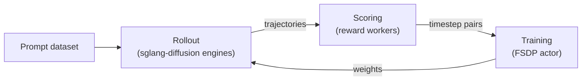
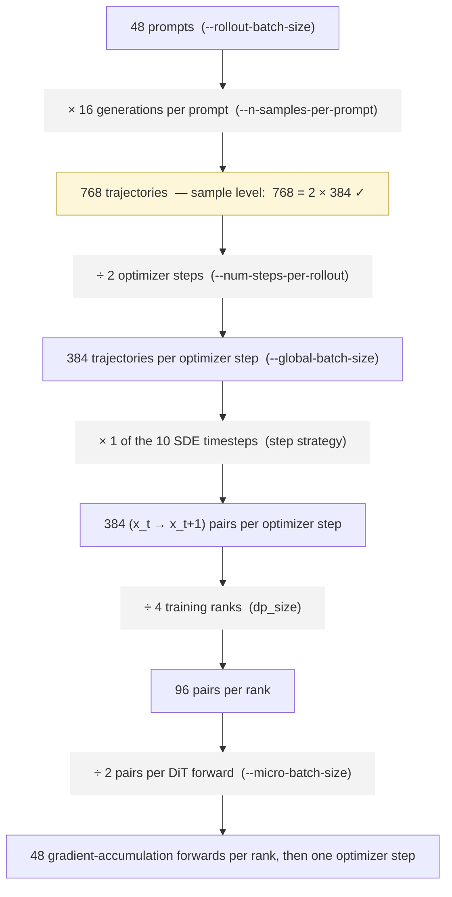

A miles-diffusion training job is a loop over four objects. Once you understand what each one *is* and how data flows
between them, the major flag groups are easier to place.

## The four objects




| Object                                 | Role                                                           | Lives in                                                                                            |
| -------------------------------------- | -------------------------------------------------------------- | --------------------------------------------------------------------------------------------------- |
| **Prompt dataset**                     | Source of prompts (plus optional metadata)                     | JSONL on disk (`--prompt-data`, `--input-key`)                                                      |
| **Rollout (sglang-diffusion engines)** | Denoises prompts into images/videos and records the trajectory | One engine per `--rollout-num-gpus-per-engine` GPUs; shipped diffusion recipes explicitly enable the miles router with `--use-miles-router` |
| **Reward workers**                     | Map `(prompt, generated output) → score`                       | Built-in `rm_hub` (`--rm-type ocr / pickscore`) or custom (`--custom-rm-path`) — Ray actor pools    |
| **Actor (FSDP2 + diffusers)**          | The DiT being trained, usually via LoRA                        | HF checkpoint (`--hf-checkpoint`), family resolved by `TrainPipelineConfig`                         |


## The training loop

The whole of `train_diffusion.py` is three calls per iteration:

```python
for rollout_id in range(start_rollout_id, num_rollout):
    # 1. Sample + 2. Score: prompts -> scored denoising trajectories
    rollout_data = rollout_manager.generate(rollout_id)

    # 3. Optimize: expand trajectories to (x_t -> x_{t+1}) pairs,
    #    micro-batch, and step the loss plugin (--loss-type)
    actor_model.async_train(rollout_id, rollout_data)

    # 4. Sync: push updated weights (or LoRA pairs) to rollout engines
    actor_model.update_weights()
```

Every flag in miles-diffusion configures one of these four phases.

## The batch-knob invariant

In miles-diffusion a sample is a whole denoising **trajectory**, and the fan-out continues below it: a step strategy
picks the trained timesteps, and micro-batching counts **(x_t → x_{t+1}) pairs**. One equation per level.

**Trajectory level** — the four-knob invariant, enforced in `miles/utils/arguments.py`. `rollout_batch_size` is
required and `n_samples_per_prompt` defaults to 1; of the right-hand pair, set one and the other is derived
(passing both with contradicting values aborts):

```bash
rollout_batch_size × n_samples_per_prompt
    = global_batch_size × num_steps_per_rollout
```

**Pair level** — what each optimizer step actually trains:

```bash
pairs_per_optimizer_step
    = global_batch_size × trained_timesteps_per_trajectory
```

The step strategy picks `trained_timesteps_per_trajectory`. Each rank then trains its `1 / dp_size` share,
`micro_batch_size` pairs per forward, accumulating gradients until the optimizer step.

Two independent knobs control physical batching, one per side of the loop:

| Knob                          | Side     | Governs                         |
| ----------------------------- | -------- | ------------------------------- |
| `--rollout-microgroup-size` | rollout  | Samples per engine **request**  |
| `--micro-batch-size`          | training | Train pairs per DiT **forward** |

And one knob controls the trajectory→pair fan-out itself: `--diffusion-step-strategy-path` picks the SDE step subset per
rollout (`sde_window`, `epoch_global_random_choice`, or your own function in `miles/rollout/step_strategy_hub.py`).
Training the full 10-step schedule would multiply the pair count by 10× in the example below.

Here is a full example with the numbers:



## Next

- [Launch Scripts](launch-script.md) — a canonical launcher, group by group.
- [Rewards](rewards.md) — `rm_hub`, custom reward functions, prompt data format.
- [CLI Reference](cli-reference.md) — every flag, fully cataloged.
- [SDE Step Backend](../advanced/sde-backend.md) — how train-side log-probs mirror rollout stepping.

